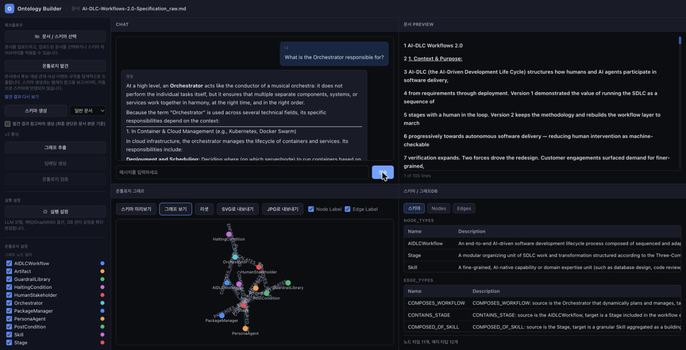

# Ontology Builder

문서를 업로드하면 LLM이 온톨로지 스키마(엔티티/관계 타입)를 제안하고, 그 스키마에 맞춰 문서에서 노드와 엣지를 추출해 지식 그래프로 만들어줍니다. 챗봇에 질문하면 이 그래프에서 관련 정보를 찾아(GraphRAG) 답변에 활용하기 때문에, 문서 내용에 기반한 더 정확한 답변을 받을 수 있습니다.



## 주요 기능

- **문서 업로드 → 마크다운 변환**: PDF, Word, PPT, CSV 등 다양한 형식을 지원 (`anydoc` 기반), 원본 파일명은 별도 매니페스트에 보존
- **온톨로지 스키마 생성**: LLM이 문서에 맞는 노드/엣지 타입을 제안, 다른 문서의 스키마를 재사용도 가능
- **그래프 추출**: 스키마에 따라 문서에서 실제 엔티티(노드)와 관계(엣지)를 추출, 그래프DB(LadybugDB)에 저장
- **그래프 시각화**: 추출된 그래프를 인터랙티브하게 확인 (줌/팬/드래그, 노드·엣지 타입별 필터)
- **GraphRAG 챗봇**: 질문과 관련된 그래프 노드를 찾아 주변 정보를 함께 참고해서 답변 (키워드 매칭 → 임베딩 유사도 → 해당 타입 전체, 3단계 폴백). 답변에 표시되는 관련 타입/노드를 클릭하면 그래프에서 해당 타입을 켜고 끄거나 관련 노드를 하이라이트·자동 포커스. 응답을 기다리는 동안 ESC로 취소 가능
- **관측성(Observability)**: 모든 LLM 호출(채팅/스키마 생성/추출/키워드 추출)을 Jaeger로 추적, DB 장애 시 리셋 가능
- **공유 비밀번호 로그인 (선택)**: 배포 환경에서 `APP_PASSWORD`를 설정하면 하나의 비밀번호로 접근을 제한하는 로그인 화면이 뜹니다. 계정 구분 없이 모든 사용자가 동일한 데이터를 봅니다. 로컬 개발에서는 설정하지 않으면 그대로 비활성 상태입니다.

## 아키텍처

```
┌───────────────────────────┐         ┌──────────────────────────────┐
│  frontend (Vue 3 + Vite)  │  HTTP   │      backend (FastAPI)        │
│  :5173, /api/* 를 백엔드로 │ ──────► │      :8000, uvicorn --reload  │
│  프록시                    │         └──────────────┬─────────────────┘
└───────────────────────────┘                          │
                                    ┌───────────────────┼───────────────────┐
                                    ▼                    ▼                    ▼
                             OpenRouter API        anydoc (Rust)      backend/data/
                          (langchain, 채팅 +      문서 → 마크다운       graph.ladybugdb
                        스키마/추출/임베딩)                          (노드/엣지, LadybugDB)
                                    │
                                    ▼
                              Jaeger (:16686)
                         모든 LLM 호출 추적/시각화
```

두 서비스(frontend/backend)는 `podman-compose.yml`로 각각 별도 컨테이너에서
실행되며, 개발 중 핫리로드를 위해 소스가 볼륨 마운트됩니다. 더 자세한 구조는
[`docs/SPEC.md`](docs/SPEC.md), 개념 설명은 [`docs/presentation.html`](docs/presentation.html)
를 참고하세요.

## 사전 준비물

- [Podman](https://podman.io/) + `podman machine` (컨테이너 실행)
- [podman-compose](https://github.com/containers/podman-compose)
- [OpenRouter](https://openrouter.ai/) API 키

## 설치 및 실행

```bash
# 1. podman machine이 없다면 생성 및 시작
podman machine init
podman machine start

# 2. 백엔드 환경변수 설정
cp backend/.env.example backend/.env
# backend/.env를 열어 OPENROUTER_API_KEY에 실제 키를 입력

# 3. 데이터 디렉토리 준비 (최초 1회)
mkdir -p backend/data && touch backend/data/.gitkeep

# 4. 전체 스택 빌드 및 실행
podman-compose up --build -d
```

실행되면 브라우저에서 `http://localhost:5173`으로 접속합니다.

모든 LLM 호출(채팅, 스키마 생성, 그래프 추출, GraphRAG 검색)은 `http://localhost:16686` (Jaeger UI)에서 추적할 수 있습니다.

바로 사용해볼 문서가 없다면 `samples/`에 준비된 삼성생명 약관 5종을
`backend/data/`에 복사한 뒤 스택을 재시작하면 됩니다 (`samples/README.md` 참고):

```bash
cp samples/*.md backend/data/
podman-compose down && podman-compose up --build -d
```

## 사용 방법

1. 좌측 패널에서 문서를 업로드
2. 업로드된 문서를 목록에서 선택
3. "스키마 생성" → "그래프 추출" 순서로 클릭 (또는 라이브러리의 기존 스키마를 재사용)
4. 우측 패널에서 추출된 그래프 확인
5. 가운데 채팅창에서 문서 내용에 대해 질문 (선택된 문서의 그래프를 참고해서 답변)
6. 답변에 표시된 타입/노드 칩을 클릭해 그래프에서 확인 (타입 칩은 필터 토글, 노드 칩은 하이라이트+자동 포커스)

## 종료

```bash
podman-compose down
```

## 배포 (Render)

`render.yaml`로 백엔드(FastAPI, Docker)와 프론트엔드(정적 사이트)를
별도 서비스로 배포합니다. Render 대시보드에서 `OPENROUTER_API_KEY`를
설정해야 하고, 접근을 하나의 공유 비밀번호로 제한하려면
`APP_PASSWORD`도 함께 설정하세요 (둘 다 `render.yaml`에는 값 없이
`sync: false`로만 선언되어 있어, 실제 값은 대시보드에서 직접 입력해야
합니다). 자세한 내용은 [`docs/SPEC.md`](docs/SPEC.md)의 "Deployment
(production, Render)" 절을 참고하세요.

## 더 알아보기

- 온톨로지·그래프DB·GraphRAG·프론트/백엔드 구조를 쉽게 설명한 프레젠테이션: [`docs/presentation.html`](docs/presentation.html) (브라우저로 열기)
- 전체 아키텍처, API 엔드포인트, 컴포넌트 구조: [`docs/SPEC.md`](docs/SPEC.md)
- 개발 환경에서 자주 겪는 문제(podman/virtiofs 마운트 이슈 등), 커맨드 모음: [`CLAUDE.md`](CLAUDE.md)
